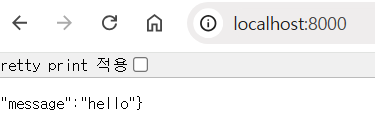

# 장고를 이용한 파이썬 API서버 만들기
---
장고(Django)는 파이썬(Python)의 대표적인 웹프레임워크입니다. 이걸 이용해서 풀스택 웹개발을 할 수 있지만, 파이썬 풀스택 개발자는 입지가 좁은 편이라 좋은 선택이 아니지요. 그래서, 파이썬 개발자는 장고를 이용해서 API 서버를 만든 뒤, 자바스크립트(JavaScript)로 만든 프론트엔드 웹페이지에 연결하는 방식을 선호하는 편입니다. 이번에 살펴볼 개발 예시는 장고를 이용해 파이썬 API 서버를 만드는 작업이예요.
</p></br></br>

## API (Application Programming Interface)
---
API는 다양한 설명을 찾아볼 수 있지만, 간단히 말해서 프로그램 사이의 통신에 쓰이는 형식을 정의한 것이라고 알아두시면 됩니다. 일상적인 예시로 들자면, 식당에 들어가서 찾아볼 수 있는 메뉴판같은 것이죠. 메뉴판에 있는 음식을 주문해야 요리를 받아볼 수 있듯이 API 정의서를 참고해서 지정된 형태로 데이터를 요청(Request)해야 알맞은 응답(Response)을 받을 수 있습니다.
</p></br></br>

## API 만들기 실습
---
이제, 장고를 활용해서 아래 표와 같은 입출력 구조를 만들어 보도록 하겠습니다. 표만 보면 어려워 보이지만, 사실 특별한 기능 없는 API입니다. 예를 들어, https://웹사이트_주소/whoami 주소로 접속하면 {"name": "ari"} 라고 하는 json 응답이 나오는 구조예요. 시작하기 전에, 미리 장고를 설치해 두시는걸 잊지 마세요.
</p></br></br>


|            엔드포인트           |     HTTP     메서드    |                   입력                 |                      출력 (리턴)                     |                          설명                         |
|:-------------------------------:|:----------------------:|:--------------------------------------:|:----------------------------------------------------:|:-----------------------------------------------------:|
|     /                           |           GET          |                   없음                 |                 {"message":   "hello"}               |                  기본 메시지     반환                 |
|     /bye                        |           GET          |                   없음                 |                  {"message":   "bye"}                |                 "bye"   메시지     반환               |
|     /whoami                     |           GET          |                   없음                 |                   {"name":   "ari"}                  |                 사용자   이름     반환                |
|     /greeting/{input_string}    |           GET          |     input_string     (Path   Param)    |     {"greeting":        "{input_string}   hello"}    |     입력   문자열 뒤에   "hello"   추가하여   반환    |

</p></br></br>

### 프로젝트 생성
---
우선은 장고 프로젝트와 앱을 하나 만들어 두어야 합니다. 읽기 편하게 `myproject` 라는 프로젝트 이름과 `myapp` 이라는 앱 이름으로 정해두려 하는데요, 적당한 폴더에 터미널 명령어로 아래와 같이 입력해 주면 됩니다.
</p></br></br>

```{bash}
django-admin startproject myproject
cd myproject
python manage.py startapp myapp
```
</p></br></br>

### 앱 연결
---
이제는 만들어둔 myapp을 프로젝트에 등록해 줘야 합니다. myproject/settings.py 파일을 찾아가서 INSTALLED_APPS 항목에 'myapp'을 추가해 주세요.

```
# myproject/settings.py
INSTALLED_APPS = [
    ...
    'myapp',
]
```

</p></br></br>

### URL 정의
---
다음은 위에서 제시한 표와 같이 URL를 정의할 차례입니다. myproject/urls.py 파일을 찾아가서 아래와 같이 urlpatterns를 등록해 주시면 됩니다. 위의 표를 살펴보시면, greeting은 하위 path에 임의의 문자열을 입력할 수 있는 구조라서 다른 URL과는 다르다는걸 확인할 수 있습니다. 이 특징은 urlpatterns에서도 드러나는데요, 'greeting/<str:input_string>/' 이라고 정의되어 있는걸 확인할 수 있습니다.
</p></br></br>

```
# myproject/urls.py
from django.contrib import admin
from django.urls import path
from myapp import views

urlpatterns = [
    path('admin/', admin.site.urls),
    path('', views.hello),
    path('bye/', views.bye),
    path('whoami/', views.whoami),
    path('greeting/<str:input_string>/', views.greeting),
]

```
</p></br></br>

### 리턴값 정의
---
이제 URL 연결까지 끝났으면, 각 URL에 따른 리턴값을 정의해야 합니다. 이 부분은 myapp/views.py 파일에 각 URL의 이름과 동일한 함수로 정의해 줘야 합니다. 우리는 json 데이터로 response를 할 것이기 때문에, JsonResponse 클래스를 활용해 주는 것을 잊지 마세요.
</p></br></br>

```
# myapp/views.py
from django.http import JsonResponse

def hello(request):
    return JsonResponse({'message': 'hello'})

def bye(request):
    return JsonResponse({'message': 'bye'})

def whoami(request):
    return JsonResponse({'name': 'ari'})

def greeting(request, input_string):
    return JsonResponse({'greeting': f'{input_string} hello'})

```
</p></br></br>

### 테스트
---
이렇게 하면 간단하게 장고를 이용한 파이썬 API 서버 만들기가 끝났습니다. 테스트를 위해서는, 프로젝트 메인 디렉토리로 이동한 뒤, 아래 명령어를 입력해 주면 됩니다.
</p></br></br>

```{bash}
python manage.py runserver
```
</p></br></br>

그 다음에는 http://localhost:8000/ URL로 접속한 뒤 {'message': 'hello'} 라는 리턴이 나오는지 확인해 보고, 하위 path에 bye, whoami 등의 입력을 해서 테스트해 보시면 끝입니다. 제대로 따라했다면 아래와 같은 형태의 화면이 나올겁니다.
</p></br></br>

<center></center>
